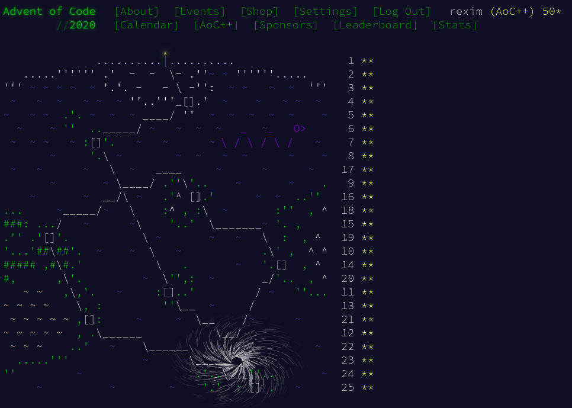

# Solutions for [Advent of Code 2020](https://adventofcode.com/2020) from Tsoding



- The problems are solved live on [https://twitch.tv/tsoding](https://twitch.tv/tsoding).
- The playlist of archived Advent of Code solutions is available on YouTube: [https://www.youtube.com/playlist?list=PLpM-Dvs8t0Vba3v-9lweHuomr0DPhdX6P](https://www.youtube.com/playlist?list=PLpM-Dvs8t0Vba3v-9lweHuomr0DPhdX6P)

## Environment

```console
$ neofetch
       _,met$$$$$gg.          rexim@rexim-B590
    ,g$$$$$$$$$$$$$$$P.       ----------------
  ,g$$P"     """Y$$.".        OS: Debian GNU/Linux 10 (buster) x86_64
 ,$$P'              `$$$.     Host: 20208 Lenovo B590
',$$P       ,ggs.     `$$b:   Kernel: 4.19.0-12-amd64
`d$$'     ,$P"'   .    $$$    Uptime: 19 days, 12 hours, 34 mins
 $$P      d$'     ,    $$P    Packages: 2541 (dpkg)
 $$:      $$.   -    ,d$$'    Shell: bash 5.0.3
 $$;      Y$b._   _,d$P'      Resolution: 1366x768
 Y$$.    `.`"Y$$$$P"'         WM: i3
 `$$b      "-.__              CPU: Intel i5-3230M (4) @ 3.200GHz
  `Y$$                        GPU: NVIDIA GeForce 610M/710M/810M/820M / GT 620M/625M/630M/720M
   `Y$$.                      GPU: Intel 3rd Gen Core processor Graphics Controller
     `$$b.                    Memory: 2283MiB / 7816MiB
       `Y$$b.
          `"Y$b._
              `"""
```
